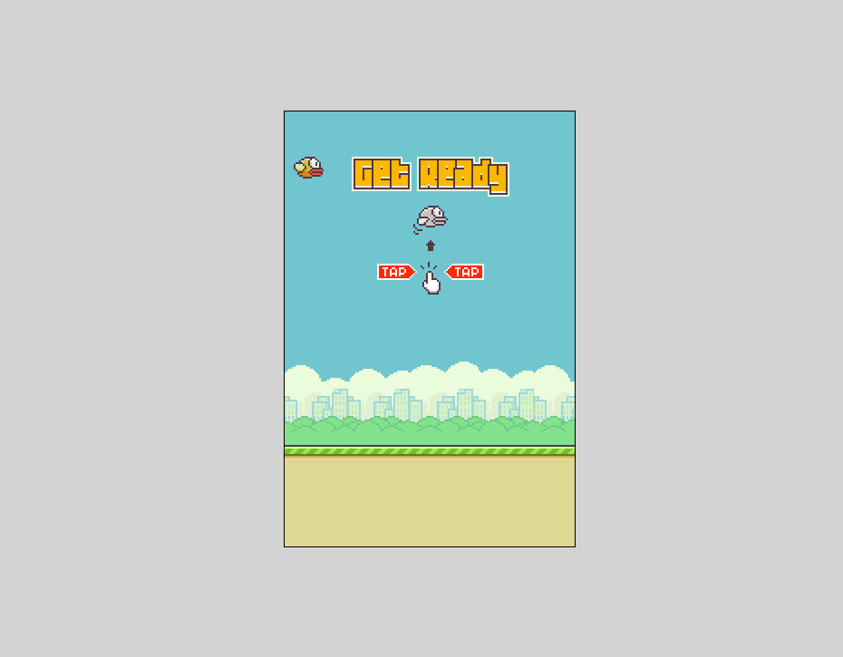
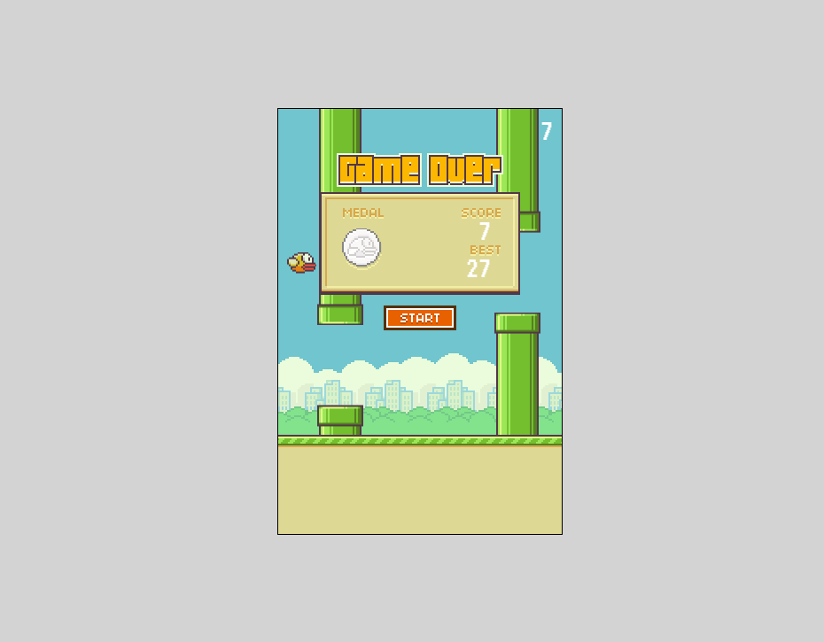

# Projeto Jogo Flappy Bird
O jogo <b>Flappy Bird</b> tem como objetivo central acumular o maior número possível de pontos, 
controlando um pássaro através de cliques do mouse, mantendo-o no ar sem permitir que ele colida com os canos. 
Qualquer contato do pássaro com um cano ou uma queda resulta no término imediato do jogo.

O jogo foi desenvolvido inspirado no [tutorial Dev Soutinho](https://youtu.be/jOAU81jdi-c?si=Wu3JfVOwwkIHCDgm), mas foram implementadas diversas
modificações para enriquecer a experiência:
- Adição de efeitos sonoros para o voo do pássaro
- Implementação do histórico de pontos para acompanhar o desempenho ao longo das partidas
- Inclusão da exibição do placar(score) e melhor pontuação(best) na tela de game over
- Inclusão da exibição de uma medalha na tela de encerramento, de acordo com a pontuação, que pode ser ouro, prata ou bronze
- Adição da função de identificação de clique no botão start para reiniciar o jogo
  
## 💻 Layout  

  
  

    
## 🔧 Tecnologias

O projeto foi desenvolvido utilizando as seguintes tecnologias:
- HTML
- Canvas
- CSS
- Javascript

## 🛠️ Como Executar o Projeto

Para jogar, basta [clicar aqui](https://jogo-flappy-bird-six.vercel.app/) e desfrutar da experiência!
Divirta-se!
